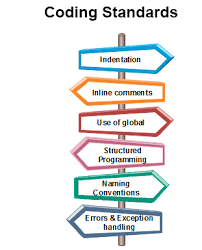

## Why is coding standard important? 
I discussed the coding standard with my peers when I first began to learn programming. I used to think the standard is a hassle and unnecessary to implement. 
However, that was the beginning phase of learning how to code. When my codes are less than 20 lines. As things advanced, the line of codes increased to hundreds and separated into different files for classes. 
I realized that the standard is imperative for us. Indentation, spaces, and proper naming conventions became incredibly crucial when the size of the enlarged. 
I like to think that building architecture, a proper foundation, and a structured plan are required to build a building. That’s what the coding standard is there for. 
It maintains the compactness of the code. Neatness is a practice every developer should do daily. Without the coding standard, our code is like a messy drawer. 
We know there are a bunch of objects inside, but it made it difficult for us to search for a particular item.  

## Thoughts after implementing ESlint.  
After implementing ESlint in the IntelliJ Idea, I was impressed by its utilities. This tool is astonishing because it warns the coder about a certain line of code not meeting the standards. It provides suggestions to fix it. We can either manually fix the code or the tool will do that automatically for us. In addition, developers will become more aware of the standards. This is crucial because we can develop a neat code without the assistance of ESlint. Like driving a car, it’s nice to have a reverse camera or sensor to assist us how to parallel parking or reverse parking. But it’s also significant for the driver to know how to do it without the tool. Like ESlint, it reminds us of where the thing went wrong but the developers should also be aware of the mistakes. 
