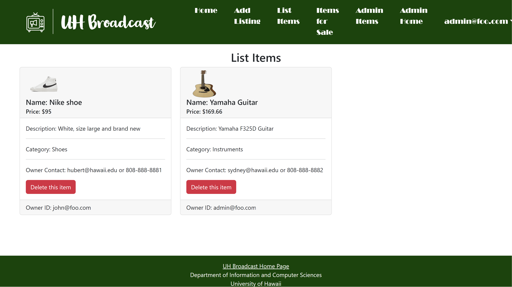

UH-Broadcast is an example web application that provides pages to view and post listings of various items for the UH community. The problem: UHM students have a “rapid” churn rate in goods and services. Students leave the dorm for an on-campus apartment and need to get rid of dorm-specific stuff and acquire apartment-specific stuff. Students graduate and need to get rid of stuff because they’re moving off-island. There is therefore a tremendous amount of “campus-specific” goods and services that could be more effectively recycled and reused if there was an effective marketplace for these specific kinds of items.

My contribution to this project is the User Listing page and the admin Listing page. These pages are used to output the listing that the current user listed on the website. I created an Item collection that stored all the listings in the collection including the owner’s account information. Once the user hits the delete this item button, the item should be removed from the collection. Differing from the user's list item page, the admin list item page should have the privilege to list every item in the item collections. 

Source Code: <a href="https://github.com/UH-Broadcast/BroadcastHosting"><i class="large github icon "></i>UH-Broadcast</a>
