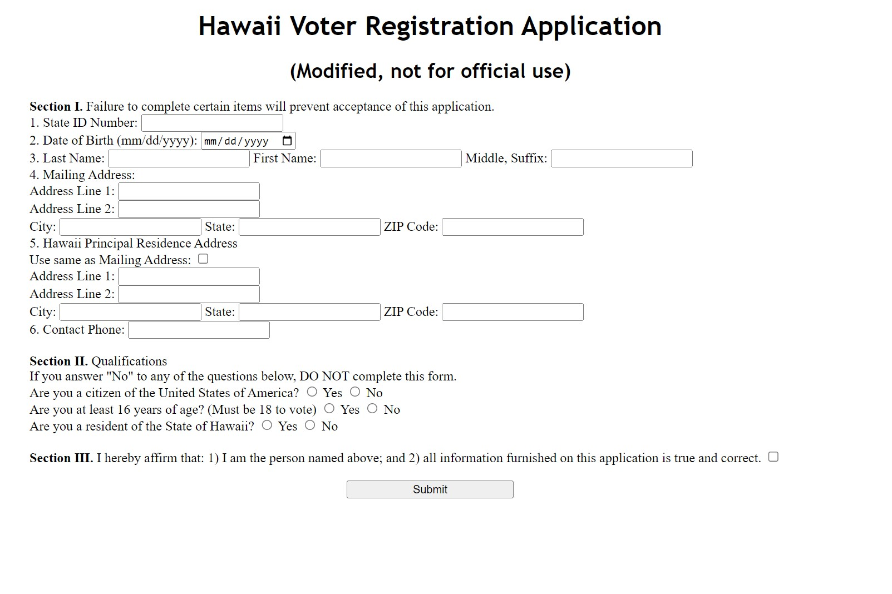

 1) The State ID number,first and last name, date of birth, mailing address, state, city, zip is not blank.
 2) Make sure the State ID number, zipcode, and phone number is correctly entered.
 3) Enusure the voter is US citizen, age of 16 and over, and Hawaii resident. And also ensure all radio buttons and affirm checkbox are checked.

Here is some code that illustrates how the program read values:

```cpp
document.voterapp.addEventListener("submit", function(eventParam){
 // What user enter for the State ID number
 let inputStateId = document.voterapp.idNum.value;
 //createing regex pattern for the state ID
 //Begins with uppercase S follow by 8 uppercase letter or digits
 let stateIdPattern = /^[A-Z][A-Z|0-9]{8}$/;

 //If the input is empty, sent an alert to the using to ask them input the ID Number
 if(inputStateId.length == 0 || inputStateId.length < 8){
   alert("ID Number Error: Please enter StateID number and length of the ID number is 8");
   eventParam.preventDefault();
   return;
 }
 else if(!stateIdPattern.test(inputStateId)){
   alert("ID Number Error: Must start with an S followed by 8 uppercase letters or digits.");
   eventParam.preventDefault();
   return;
 }

 //validate birthdate is entered
 //retrieve the value from the dob tag and store in a variable
 let birthdateValue = document.voterapp.dob.value;

 if(birthdateValue.length == 0){
   alert("Error: Please enter your date of birth.");
   eventParam.preventDefault();
   return;
 }

//validating the length of lastname and make sure is not blank
//retrieve lastname value and store it in a variable
 let lastNameValue = document.voterapp.lastname.value;
 if(lastNameValue.length == 0){
   alert("Error: Last name cannot be blank.");
   eventParam.preventDefault();
   return;
 }
//validating the length of firstname and make sure is not blank
//retrieve firstname value and store it in a variable
let firstNameValue = document.voterapp.firstname.value;
if(firstNameValue.length == 0){
  alert("Error:  First name cannot be blank.");
  eventParam.preventDefault();
  return;
}

```
